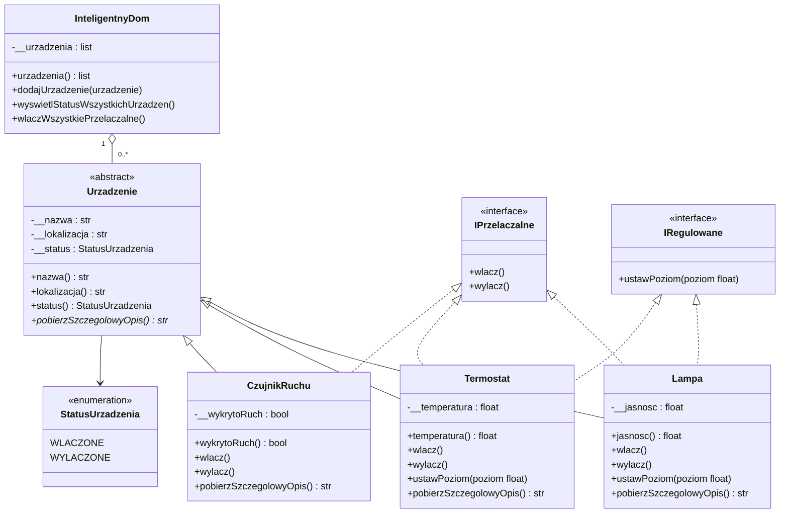

# Smart Home OOP Python

Projekt zaliczeniowy z programowania obiektowego w Pythonie. System zarządzania urządzeniami w inteligentnym domu — pokazuje hierarchię klas, interfejsy, enkapsulację i polimorfizm.

## Instalacja

Wymagany Python 3.12+ — tkinter jest wbudowany w standardowy instalator Pythona dla Windows.

Utwórz i aktywuj środowisko wirtualne:

```bash
python -m venv .venv
source .venv/bin/activate   # Linux/Mac
.venv\Scripts\activate      # Windows
```

Zainstaluj zależności projektu:

```bash
pip install -r requirements.txt
```

## Jak uruchomić

Aplikacja (GUI):

```bash
PYTHONPATH=src python -m smart_home
```

Testy:

```bash
PYTHONPATH=src python -m unittest discover -s tests -v
```

## Struktura repo

```text
smart-home-oop-python/
├── src/smart_home/
│   ├── domain.py       # wszystkie klasy domenowe
│   ├── gui.py          # interfejs graficzny (customtkinter)
│   ├── __init__.py     # publiczny interfejs pakietu
│   └── __main__.py     # entry point
├── tests/
│   └── test_smart_home.py
├── docs/
│   └── uml/
│       └── diagram.md  # diagram klas (Mermaid)
└── examples/
```

## Diagram klas



## Model domenowy

| Klasa / Interfejs  | Rola                                                               |
| ------------------ | ------------------------------------------------------------------ |
| `Urzadzenie`       | Abstrakcyjna klasa bazowa. Enkapsuluje nazwę, lokalizację, status. |
| `Lampa`            | Urządzenie przełączalne i regulowane (poziom jasności).            |
| `Termostat`        | Urządzenie przełączalne i regulowane (temperatura docelowa).       |
| `CzujnikRuchu`     | Urządzenie wykrywające ruch.                                       |
| `StatusUrzadzenia` | Enum: `WLACZONE` / `WYLACZONE`.                                    |
| `IPrzelaczalne`    | Interfejs (Protocol): `wlacz()`, `wylacz()`.                       |
| `IRegulowane`     | Interfejs (Protocol): `ustawPoziom()`.                             |
| `InteligentnyDom`  | Agreguje urządzenia. Zarządza nimi i demonstruje polimorfizm.      |

## Pokryte tematy OOP

- dziedziczenie i `super()` — `Lampa`, `Termostat`, `CzujnikRuchu` po `Urzadzenie`
- enkapsulacja — prywatne pola urządzeń
- abstrakcyjna klasa bazowa (ABC) — `Urzadzenie` wymusza implementację `pobierzSzczegolowyOpis()`
- polimorfizm — `wyswietlStatusWszystkichUrzadzen()` wywołuje `pobierzSzczegolowyOpis()` na każdym urządzeniu
- interfejsy (Protocol) — `IPrzelaczalne`, `IRegulowane`
- Enum — `StatusUrzadzenia`
- kolekcja `list` — lista urządzeń w `InteligentnyDom`
