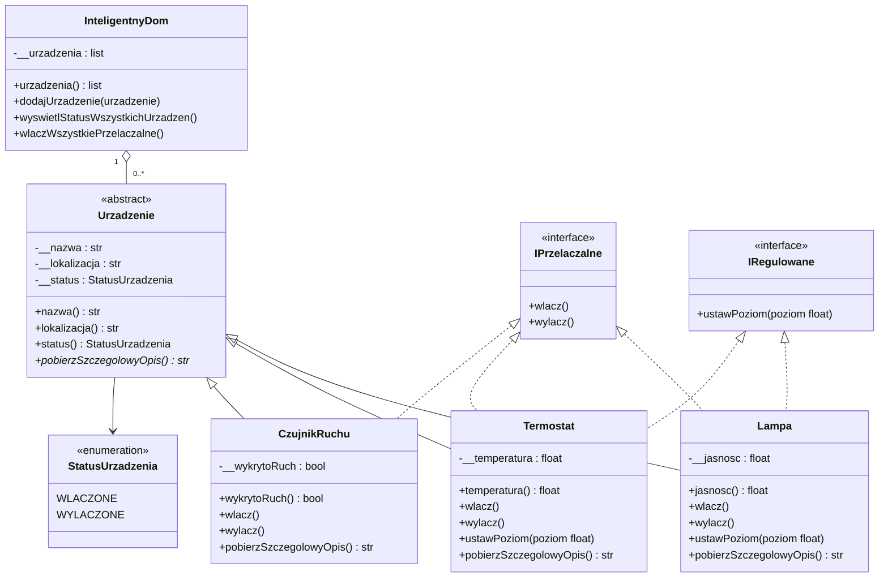

# Diagram klas — Smart Home OOP Python

```mermaid
classDiagram
    class StatusUrzadzenia {
        <<enumeration>>
        WLACZONE
        WYLACZONE
    }

    class Urzadzenie {
        <<abstract>>
        -__nazwa : str
        -__lokalizacja : str
        -__status : StatusUrzadzenia
        +nazwa() str
        +lokalizacja() str
        +status() StatusUrzadzenia
        +pobierzSzczegolowyOpis()* str
    }

    class InteligentnyDom {
        -__urzadzenia : list
        +urzadzenia() list
        +dodajUrzadzenie(urzadzenie)
        +wyswietlStatusWszystkichUrzadzen()
        +wlaczWszystkiePrzelaczalne()
    }

    class IPrzelaczalne {
        <<interface>>
        +wlacz()
        +wylacz()
    }

    class IRegulowane {
        <<interface>>
        +ustawPoziom(poziom float)
    }

    class Lampa {
        -__jasnosc : float
        +jasnosc() float
        +wlacz()
        +wylacz()
        +ustawPoziom(poziom float)
        +pobierzSzczegolowyOpis() str
    }

    class Termostat {
        -__temperatura : float
        +temperatura() float
        +wlacz()
        +wylacz()
        +ustawPoziom(poziom float)
        +pobierzSzczegolowyOpis() str
    }

    class CzujnikRuchu {
        -__wykrytoRuch : bool
        +wykrytoRuch() bool
        +wlacz()
        +wylacz()
        +pobierzSzczegolowyOpis() str
    }

    Urzadzenie <|-- Lampa
    Urzadzenie <|-- Termostat
    Urzadzenie <|-- CzujnikRuchu
    IPrzelaczalne <|.. Lampa
    IPrzelaczalne <|.. Termostat
    IPrzelaczalne <|.. CzujnikRuchu
    IRegulowane <|.. Lampa
    IRegulowane <|.. Termostat
    InteligentnyDom "1" o-- "0..*" Urzadzenie
    Urzadzenie --> StatusUrzadzenia
```
